The VoIP Load Balancer is a general-purpose public gateway service within Blazing Core that provides optional VoIP/SIP capabilities. It's designed as a flexible, industry-standard solution for handling both general traffic and voice-over-IP workloads at global scale.

## Overview

VoIP Load Balancer is a multi-region, anycast-enabled gateway that can be deployed with or without VoIP features. It combines proven open-source technologies (Kamailio, rtpengine, Asterisk) with modern cloud infrastructure to deliver a reliable, cost-effective solution.

### Key Characteristics

- **General-Purpose Gateway**: Works as a standard public load balancer without VoIP features
- **Optional VoIP Add-On**: Enable full SIP/RTP capabilities when needed
- **Industry-Standard**: Built on Kamailio + rtpengine + Asterisk stack
- **Multi-Region**: Deploy across multiple regions with anycast routing
- **Cloudflare Front Door**: Global edge network for optimal routing and DDoS protection

## Pricing

VoIP Load Balancer uses a simple, transparent pricing model:

- **Base Gateway**: $49/month
  - General-purpose public load balancer
  - Multi-region deployment
  - Cloudflare front door
  - Standard traffic handling

- **VoIP Add-On**: +$50/month
  - Full SIP/RTP capabilities
  - Kamailio SIP proxy
  - rtpengine media relay
  - Asterisk integration

**Total with VoIP**: $99/month

## Architecture

The VoIP Load Balancer uses a proven, industry-standard architecture:

```mermaid
graph TB
    Client[Clients/Users] --> GLB1[Global LB 1<br/>Public IP 1]
    Client --> GLB2[Global LB 2<br/>Public IP 2]

    GLB1 --> R1[Region 1]
    GLB1 --> R2[Region 2]
    GLB1 --> R3[Region N]

    GLB2 --> R1
    GLB2 --> R2
    GLB2 --> R3

    R1 --> K1[Kamailio 1]
    R2 --> K2[Kamailio 2]
    R3 --> K3[Kamailio N]

    K1 --> RTP1[rtpengine 1]
    K1 --> AST1[Asterisk 1]

    K2 --> RTP2[rtpengine 2]
    K2 --> AST2[Asterisk 2]

    K3 --> RTP3[rtpengine N]
    K3 --> AST3[Asterisk N]

    AST1 -.Service Mesh.-> AST2
    AST2 -.Service Mesh.-> AST3
    AST1 -.Service Mesh.-> AST3

    style GLB1 fill:#FA4F1D,stroke:#FA4F1D,color:#fff
    style GLB2 fill:#FA4F1D,stroke:#FA4F1D,color:#fff
    style R1 fill:#1a1a1a,stroke:#FA4F1D
    style R2 fill:#1a1a1a,stroke:#FA4F1D
    style R3 fill:#1a1a1a,stroke:#FA4F1D
```

### Components

1. **Cloudflare Front Door**
   - Global anycast routing
   - DDoS protection
   - SSL/TLS termination
   - Geographic load balancing

2. **Kamailio** (VoIP Add-On)
   - SIP proxy and registrar
   - Call routing logic
   - NAT traversal
   - Load distribution

3. **rtpengine** (VoIP Add-On)
   - RTP/RTCP media relay
   - Media transcoding
   - Recording capabilities
   - NAT traversal for media

4. **Asterisk** (VoIP Add-On)
   - PBX functionality
   - IVR capabilities
   - Call queuing
   - Voicemail

## Use Cases

### General Gateway

Without VoIP features, the load balancer serves as a robust public gateway:

- **API Endpoints**: Global edge routing for REST/GraphQL APIs
- **Web Applications**: Geographic load distribution for web traffic
- **Microservices**: Public-facing ingress for containerized services
- **Content Delivery**: Front door for media and static content

### VoIP/SIP Services

With VoIP add-on enabled:

- **SIP Trunking**: Connect traditional telephony to cloud infrastructure
- **WebRTC Gateway**: Bridge browser-based calling to SIP networks
- **Call Centers**: Distribute inbound calls across agents
- **Unified Communications**: Handle voice, video, and messaging
- **IoT/Embedded**: Voice capabilities for devices and applications

## Why Industry-Standard?

The VoIP Load Balancer is intentionally built on proven, open-source technologies rather than proprietary solutions:

- **Kamailio**: Battle-tested SIP proxy used by major carriers worldwide
- **rtpengine**: High-performance media relay with extensive codec support
- **Asterisk**: The most widely deployed open-source PBX platform

This approach provides:

- ✅ **No Vendor Lock-In**: Configurations are portable and standard
- ✅ **Extensive Documentation**: Leverage community knowledge and resources
- ✅ **Proven Reliability**: Technologies trusted by telecom carriers
- ✅ **Flexibility**: Full control over SIP routing and media handling
- ✅ **Cost-Effective**: No proprietary licensing fees

## Multi-Region Deployment

Deploy VoIP Load Balancers across multiple regions for:

- **Geographic Redundancy**: Automatic failover between regions
- **Reduced Latency**: Route users to nearest gateway
- **Compliance**: Keep data in specific geographic regions
- **Scale**: Distribute load across global infrastructure

Cloudflare's anycast network automatically routes users to the optimal region based on latency and availability.

## Getting Started

Ready to deploy a VoIP Load Balancer?

1. **Without VoIP**: Start with the base gateway for $49/month
2. **With VoIP**: Enable the VoIP add-on for full SIP/RTP capabilities
3. **Multi-Region**: Deploy across regions for global coverage

<Alert type="info">
  

    
Base Gateway + Optional VoIP

    

      The VoIP Load Balancer starts as a general-purpose gateway ($49/month).
      Add VoIP capabilities (+$50/month) only when you need SIP/RTP features.
    

  

</Alert>

## Next Steps

- **Quick Start**: Deploy your first VoIP Load Balancer
- **Configuration**: Configure Kamailio, rtpengine, and Asterisk
- **Multi-Region**: Set up geographic redundancy
- **Monitoring**: Track SIP calls and media quality

## Support

Need help with VoIP Load Balancer?

- **Documentation**: Browse our comprehensive guides
- **Community**: Join our Discord for peer support
- **Enterprise Support**: Contact our team for dedicated assistance
