Flow Sandbox is an isolated testing and development environment within Blazing Flow that allows you to prototype, test, and validate workflow orchestration workloads before deploying to production.

<Alert type="warn">
  <div className="flex flex-col gap-2">
    <div className="font-semibold">Coming Soon</div>
    <div>
      Flow Sandbox is currently in development. Get in touch for priority access and early-bird pricing.
    </div>
  </div>
</Alert>

## Overview

Flow Sandbox provides a safe, isolated environment where you can:

- **Test Workflows**: Run and debug workflow orchestrations without affecting production
- **Prototype Pipelines**: Experiment with data processing workflows
- **Validate at Scale**: Test with production-sized datasets in isolation
- **Develop Safely**: Build and iterate on workflows in a dedicated environment

### Key Features

- **Isolated Execution**: Complete separation from production workloads
- **Production-Like**: Same infrastructure and capabilities as production Blazing Flow
- **Cost-Effective**: Pay only for the resources you use during testing
- **Quick Provisioning**: Spin up sandbox environments in minutes
- **Easy Migration**: Promote tested workloads to production with minimal changes

## Use Cases

### Development and Testing

Create dedicated sandbox environments for:

- **Unit Testing**: Test individual workflow components in isolation
- **Integration Testing**: Validate end-to-end data pipelines
- **Performance Testing**: Benchmark jobs with production-scale datasets
- **Regression Testing**: Verify changes don't break existing functionality

### Prototyping

Experiment with new approaches:

- **Algorithm Development**: Test new data processing algorithms
- **Pipeline Design**: Prototype complex multi-stage workflows
- **Tool Evaluation**: Try different workflow orchestration tools and frameworks
- **Architecture Validation**: Prove out design patterns before production implementation

### Training and Learning

Safe environment for learning:

- **Onboarding**: Train new team members without risk
- **Experimentation**: Learn workflow orchestration best practices
- **Documentation**: Generate tutorials and runbooks
- **Demos**: Showcase capabilities to stakeholders

## How It Works

Flow Sandbox provides isolated environments with the same capabilities as production Blazing Flow:

```mermaid
graph LR
    Dev[Developer] --> SB[Sandbox Environment]
    SB --> Compute[Compute Resources]
    SB --> Storage[Isolated Storage]
    SB --> Network[Private Network]

    SB -.->|Promote| Prod[Production]

    style SB fill:#FA4F1D,stroke:#FA4F1D,color:#fff
    style Prod fill:#1a1a1a,stroke:#FA4F1D
    style Compute fill:#1a1a1a,stroke:#555
    style Storage fill:#1a1a1a,stroke:#555
    style Network fill:#1a1a1a,stroke:#555
```



### Isolation Guarantees

Each sandbox environment includes:

1. **Dedicated Compute**: Isolated processing resources
2. **Private Storage**: Separate data storage with no cross-contamination
3. **Network Isolation**: Private networking with optional connectivity
4. **IAM Separation**: Distinct identity and access management
5. **Resource Limits**: Configurable quotas to control costs

## Sandbox Lifecycle

### 1. Create Sandbox

Provision a new sandbox environment:

```bash
blazing sandbox create \
  --name my-dev-sandbox \
  --region us-west-2 \
  --compute-tier standard
```

### 2. Develop and Test

Deploy and test your workflows:

```bash
# Deploy workflow to sandbox
blazing flow deploy \
  --sandbox my-dev-sandbox \
  --job data-processing-pipeline

# Run test with sample data
blazing flow run \
  --sandbox my-dev-sandbox \
  --job data-processing-pipeline \
  --input s3://sandbox-data/sample.csv
```

### 3. Validate Results

Review outputs and metrics:

- Job execution logs
- Processing metrics
- Output data validation
- Cost analysis

### 4. Promote to Production

Once validated, promote to production:

```bash
blazing flow promote \
  --from my-dev-sandbox \
  --job data-processing-pipeline \
  --to production
```

## Sandbox Types

### Development Sandbox

For active development and iteration:

- **Persistent**: Long-lived environment for ongoing work
- **Full Access**: Complete control over configuration
- **Shared Resources**: Cost-effective resource sharing
- **Quick Iteration**: Fast deployment cycles

### Testing Sandbox

For automated testing:

- **Ephemeral**: Created on-demand for test runs
- **Reproducible**: Consistent environment for each test
- **Isolated**: Completely separate from other sandboxes
- **CI/CD Integration**: Automated testing in pipelines

### Staging Sandbox

For pre-production validation:

- **Production-Like**: Mirrors production configuration
- **Realistic Scale**: Production-sized datasets and workloads
- **Extended Retention**: Longer data retention for validation
- **Performance Testing**: Load and stress testing

## Resource Management

### Compute Resources

Control sandbox compute allocation:

- **CPU/Memory**: Configure compute tier (small, standard, large)
- **GPU Support**: Optional GPU resources for ML workloads
- **Autoscaling**: Automatic scaling within defined limits
- **Spot Instances**: Use spot instances for cost savings

### Storage

Isolated storage for each sandbox:

- **Object Storage**: S3-compatible storage for input/output data
- **Database**: Optional database for metadata and results
- **Temporary Storage**: Fast ephemeral storage for processing
- **Retention Policies**: Automatic cleanup of old data

### Cost Controls

Manage sandbox costs:

- **Resource Quotas**: Set maximum compute and storage limits
- **Auto-Shutdown**: Automatically stop inactive sandboxes
- **Budget Alerts**: Notifications when approaching spend limits
- **Usage Tracking**: Detailed cost breakdown by sandbox

## Integration with Blazing Flow

Flow Sandbox seamlessly integrates with Blazing Flow production environments:

### Shared Configurations

- **Job Definitions**: Reuse job configurations between sandbox and production
- **Secrets Management**: Separate secrets with same structure
- **Monitoring**: Same observability tools and dashboards
- **IAM Policies**: Consistent permission model

### Promotion Workflow

Move validated workloads to production:

1. **Code Review**: Review and approve workflow changes
2. **Configuration Update**: Adjust production-specific settings
3. **Gradual Rollout**: Deploy with canary or blue-green strategy
4. **Monitoring**: Track production metrics post-deployment
5. **Rollback**: Quick rollback if issues detected

## Getting Started

<Alert type="info">
  <div className="flex flex-col gap-2">
    <div className="font-semibold">Priority Access Available</div>
    <div>
      Flow Sandbox is coming soon. Contact us to get priority access and early-bird pricing.
    </div>
  </div>
</Alert>

### Prerequisites

- Blazing Flow account
- Basic understanding of workflow orchestration
- Batch job definitions ready for testing

### Quick Start

1. **Request Access**: Contact us for Flow Sandbox early access
2. **Create Sandbox**: Provision your first sandbox environment
3. **Deploy Job**: Upload and deploy a test workflow
4. **Run Tests**: Execute jobs with sample data
5. **Promote**: Move validated jobs to production

## Pricing

Flow Sandbox pricing will be based on actual resource usage:

- **Compute**: Pay for compute hours (CPU/GPU)
- **Storage**: Pay for data stored in sandbox
- **Networking**: Pay for data transfer
- **No Base Fee**: Only pay for resources used

**Coming Soon**: Detailed pricing will be announced with product launch.

## Support

Need help with Flow Sandbox?

- **Documentation**: Browse our comprehensive guides (coming soon)
- **Community**: Join our Discord for peer support
- **Priority Access**: Contact us for early access and dedicated support

## Next Steps

- **Contact Us**: Get priority access to Flow Sandbox
- **Learn More**: Read about Blazing Flow capabilities
- **Explore**: Check out workflow orchestration best practices
