Blazing Gateway is a global edge gateway that provides VoIP capabilities, intelligent traffic routing, and low-latency connectivity for real-time communication workloads within Blazing Core.

<Alert type="warning">
  <div className="flex flex-col gap-2">
    <div className="font-semibold">Coming Soon</div>
    <div>
      Blazing Gateway is currently in development. Get in touch for priority access and early-bird pricing.
    </div>
  </div>
</Alert>

## Overview

Blazing Gateway provides a global edge network for:

- **VoIP Infrastructure**: Deploy SIP servers, media gateways, and voice routing
- **Real-Time Communications**: WebRTC, SIP trunking, and call routing
- **Edge Computing**: Process traffic at the edge for ultra-low latency
- **Global Connectivity**: Multi-region deployment with intelligent failover

### Key Features

- **Global Edge Network**: Deploy across 100+ edge locations worldwide
- **VoIP Native**: Built-in SIP proxy, media gateway, and call routing
- **Low Latency**: < 50ms latency to 95% of internet users
- **Auto-Scaling**: Automatically scale based on traffic patterns
- **DDoS Protection**: Built-in protection against volumetric attacks

## Use Cases

### VoIP Infrastructure

Deploy production-ready VoIP infrastructure:

- **SIP Proxy**: Route SIP signaling traffic globally
- **Media Gateway**: Transcode and relay RTP/SRTP media streams
- **Call Routing**: Intelligent routing based on cost, quality, and location
- **Number Portability**: Support for local and toll-free numbers globally

### Real-Time Communications

Power real-time communication applications:

- **WebRTC Gateway**: Connect WebRTC clients to SIP networks
- **Video Conferencing**: Multi-party video with selective forwarding
- **Screen Sharing**: Low-latency screen sharing infrastructure
- **File Transfer**: P2P file transfer with fallback relay

### Edge Computing

Process traffic at the edge:

- **Request Routing**: Route requests to optimal backend locations
- **Protocol Translation**: Convert between protocols (SIP ↔ WebRTC)
- **Media Processing**: Transcode, mix, and record media streams
- **Analytics**: Real-time call quality metrics and analytics

## Architecture

Blazing Gateway runs at the edge of Blazing Core's global network:

```mermaid
graph LR
    Client[VoIP Client] --> Gateway[Blazing Gateway]
    Gateway --> Core[Blazing Core]
    Gateway --> PSTN[PSTN Network]
    Gateway --> Trunk[SIP Trunk]

    Core --> Services[Your Services]

    style Gateway fill:#FA4F1D,stroke:#FA4F1D,color:#fff
    style Core fill:#1a1a1a,stroke:#FA4F1D
    style Services fill:#1a1a1a,stroke:#555
    style PSTN fill:#1a1a1a,stroke:#555
    style Trunk fill:#1a1a1a,stroke:#555
```



### Components

1. **SIP Proxy**: Handle SIP signaling (INVITE, BYE, REGISTER)
2. **Media Gateway**: Process RTP/SRTP media streams
3. **Call Router**: Route calls based on policies and rules
4. **Load Balancer**: Distribute traffic across edge locations
5. **DDoS Protection**: Filter malicious traffic before it reaches infrastructure

## VoIP Features

### SIP Support

Full SIP stack implementation:

- **SIP/2.0**: RFC 3261 compliant
- **Authentication**: Digest authentication, TLS certificates
- **Encryption**: TLS for signaling, SRTP for media
- **NAT Traversal**: STUN, TURN, and ICE support
- **Codecs**: G.711, G.722, Opus, and more

### Call Routing

Intelligent call routing:

```yaml
# gateway.yaml
version: 1

routing:
  - match:
      prefix: "+1"
    route:
      - provider: "us-carrier-1"
        priority: 1
      - provider: "us-carrier-2"
        priority: 2

  - match:
      prefix: "+44"
    route:
      - provider: "uk-carrier-1"
        priority: 1
```

### Media Processing

Handle media streams:

- **Transcoding**: Convert between codecs
- **Recording**: Record calls for compliance or analytics
- **Mixing**: Mix multiple audio streams for conferencing
- **DTMF**: Detect and generate DTMF tones

## Deployment

### Edge Locations

Deploy across global edge network:

```bash
# Deploy to multiple regions
blazing gateway deploy \
  --regions us-east,us-west,eu-west,ap-south \
  --config gateway.yaml
```

### Configuration

Configure gateway behavior:

```yaml
# gateway.yaml
version: 1

gateway:
  name: voip-gateway

  sip:
    port: 5060
    tls_port: 5061
    domain: sip.example.com

  media:
    rtp_port_range: 10000-20000
    codecs:
      - opus
      - g722
      - pcmu

  routing:
    strategy: least-cost
    failover: true

  security:
    ddos_protection: true
    rate_limit: 1000
    whitelist:
      - 192.0.2.0/24
```

### Monitoring

Monitor gateway health:

- **Call Metrics**: Call volume, duration, completion rate
- **Quality Metrics**: Jitter, packet loss, MOS scores
- **System Metrics**: CPU, memory, network bandwidth
- **Alerts**: Automated alerts for anomalies

## Integration with Blazing Core

Blazing Gateway seamlessly integrates with Blazing Core:

### Service Integration

Connect gateway to Blazing Core services:

```yaml
# gateway.yaml
version: 1

integration:
  core:
    enabled: true
    services:
      - name: call-handler
        endpoint: https://call-handler.blazing.run
      - name: voicemail
        endpoint: https://voicemail.blazing.run
```

### Event Webhooks

Receive gateway events:

```python
# call-handler service
@app.route('/webhook/call-started')
async def call_started(event):
    call_id = event['call_id']
    caller = event['from']
    callee = event['to']

    # Handle call started event
    await log_call(call_id, caller, callee)

    return {'status': 'ok'}
```

## Security

### Network Security

- **DDoS Protection**: Volumetric attack mitigation
- **IP Whitelisting**: Restrict access by IP
- **Rate Limiting**: Prevent abuse and fraud
- **TLS/SRTP**: End-to-end encryption

### Fraud Prevention

- **Call Pattern Analysis**: Detect unusual call patterns
- **Cost Thresholds**: Automatic limits on high-cost calls
- **Blacklisting**: Block known fraudulent numbers
- **Authentication**: Require authentication for outbound calls

## Pricing

Blazing Gateway pricing will be based on usage:

- **Call Minutes**: Pay per minute of calling
- **Data Transfer**: Pay for RTP/SRTP traffic
- **Edge Compute**: Pay for media processing
- **No Base Fee**: Only pay for what you use

**Coming Soon**: Detailed pricing will be announced with product launch.

## Getting Started

<Alert type="info">
  <div className="flex flex-col gap-2">
    <div className="font-semibold">Priority Access Available</div>
    <div>
      Blazing Gateway is coming soon. Contact us to get priority access and early-bird pricing.
    </div>
  </div>
</Alert>

### Prerequisites

- Blazing Core account
- VoIP or real-time communication requirements
- SIP trunk or PSTN connectivity (optional)

### Quick Start

1. **Request Access**: Contact us for Blazing Gateway early access
2. **Configure Gateway**: Define your gateway configuration
3. **Deploy**: Deploy gateway to edge locations
4. **Test**: Make test calls to verify connectivity
5. **Go Live**: Route production traffic through gateway

## Support

Need help with Blazing Gateway?

- **Documentation**: Browse our comprehensive guides (coming soon)
- **Community**: Join our Discord for peer support
- **Priority Access**: Contact us for early access and dedicated support

## Next Steps

- **Contact Us**: Get priority access to Blazing Gateway
- **Learn More**: Read about Blazing Core capabilities
- **Explore**: Check out VoIP best practices
